# Exercise 2 - Architecture Diagrams

**Author:** Stanislav Buinitskii  
**Course:** Scalable Big Data Systems

This document provides visual architecture diagrams for Activity 2 and Activity 3 using Mermaid.

---

## Activity 2: Temperature Logging System

### Architecture Overview

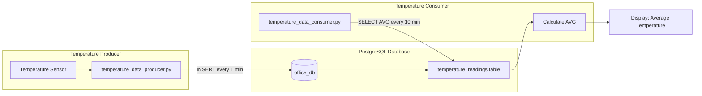

### Component Description

| Component | File | Description |
|-----------|------|-------------|
| **Temperature Producer** | `temperature_data_producer.py` | Simulates temperature sensor, generates random readings (15-35°C), inserts to PostgreSQL every minute |
| **PostgreSQL Database** | `docker-compose.yaml` | Stores temperature readings in `office_db.temperature_readings` table |
| **Temperature Consumer** | `temperature_data_consumer.py` | Polls database every 10 minutes, calculates average temperature using SQL `AVG()` |

### Data Flow

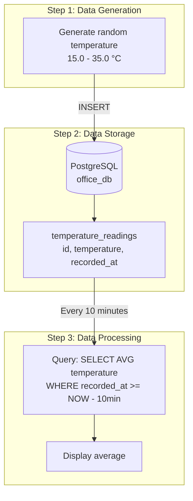

### Why Direct Polling?

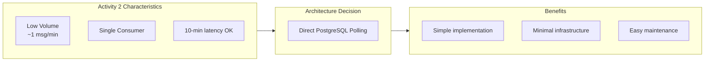

---

## Activity 3: Fraud Detection System

### Architecture Overview

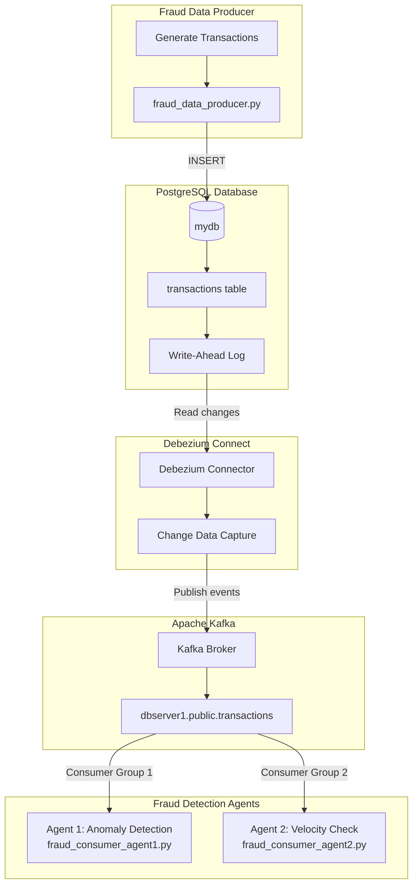

### Component Description

| Component | File/Container | Description |
|-----------|---------------|-------------|
| **Fraud Producer** | `fraud_data_producer.py` | Generates random financial transactions (user_id, amount, timestamp), inserts to PostgreSQL |
| **PostgreSQL** | `postgres` container | Stores transactions with WAL enabled for CDC |
| **Debezium Connect** | `connect` container | Monitors PostgreSQL WAL, captures INSERT/UPDATE/DELETE events |
| **Kafka Broker** | `kafka` container | Message broker, stores CDC events in topics |
| **Agent 1** | `fraud_consumer_agent1.py` | Anomaly Detection - tracks user spending patterns, flags 3σ outliers |
| **Agent 2** | `fraud_consumer_agent2.py` | Velocity Check - monitors transaction frequency, flags rapid transactions |

### CDC Event Flow

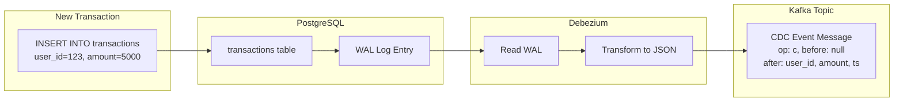

### Debezium CDC Message Structure

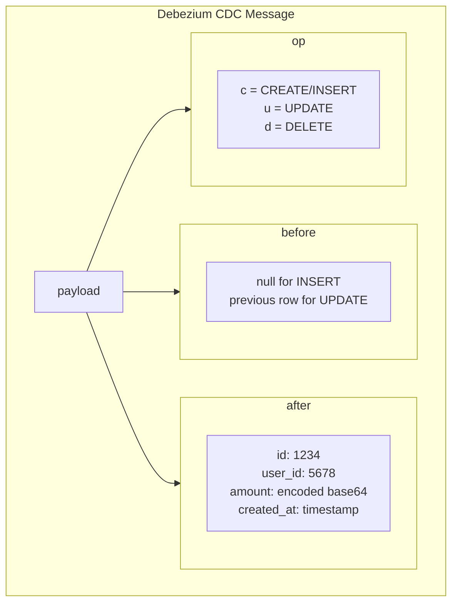

### Multi-Consumer Architecture

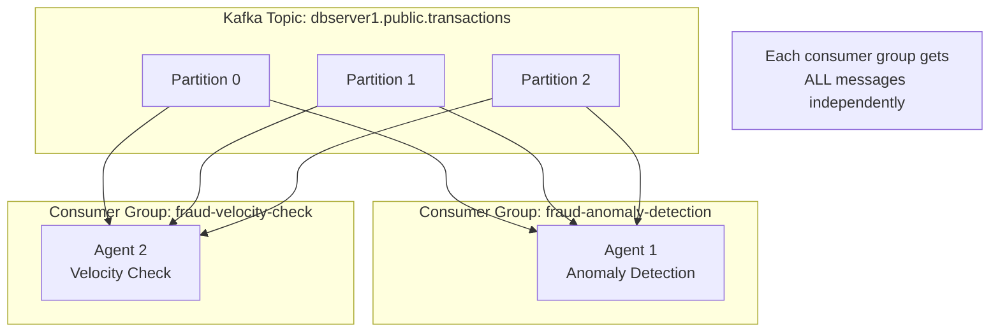

### Agent 1: Anomaly Detection Logic

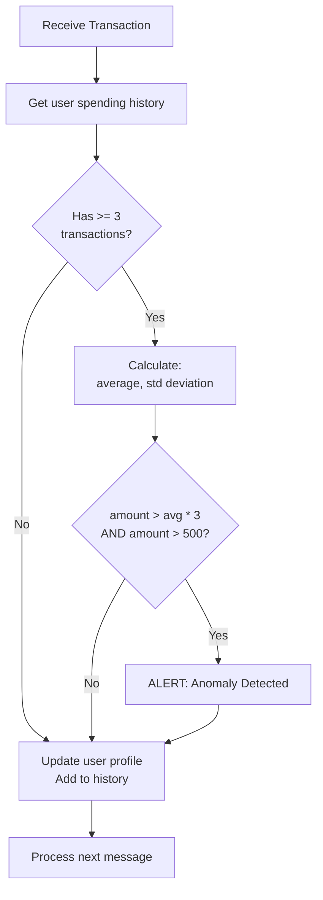

### Agent 2: Velocity Check Logic

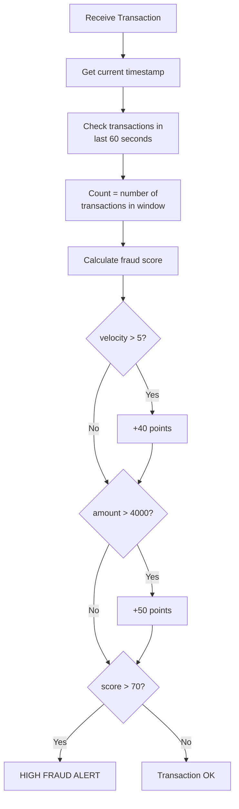

---

## Comparison: Activity 2 vs Activity 3

### Architecture Comparison

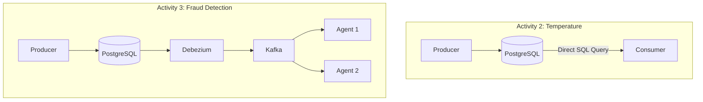

### Decision Matrix

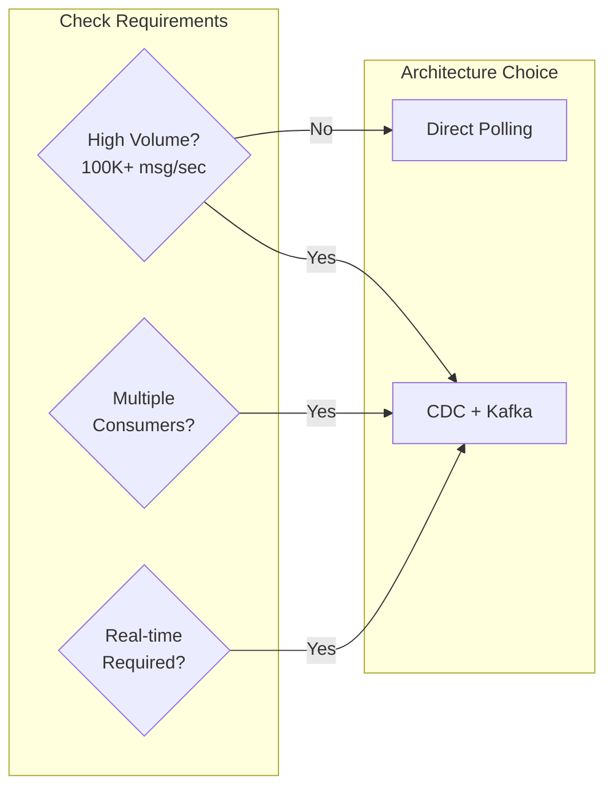

---

## Docker Infrastructure

### Container Architecture

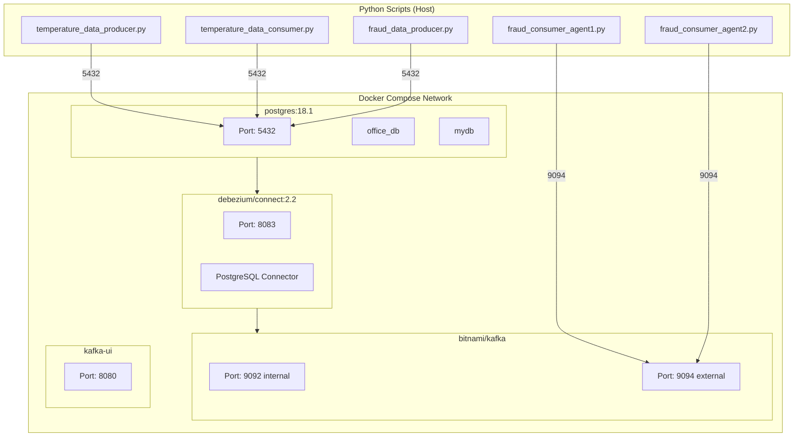

---

## Summary

| Aspect | Activity 2 | Activity 3 |
|--------|------------|------------|
| **Architecture** | Direct Polling | CDC + Kafka |
| **Components** | 2 (DB + Script) | 5 (DB + Debezium + Kafka + Agents) |
| **Latency** | 10 minutes | Milliseconds |
| **Consumers** | 1 | Multiple |
| **Scalability** | Limited | Horizontal |
| **Use Case** | Low-volume monitoring | High-volume real-time detection |
